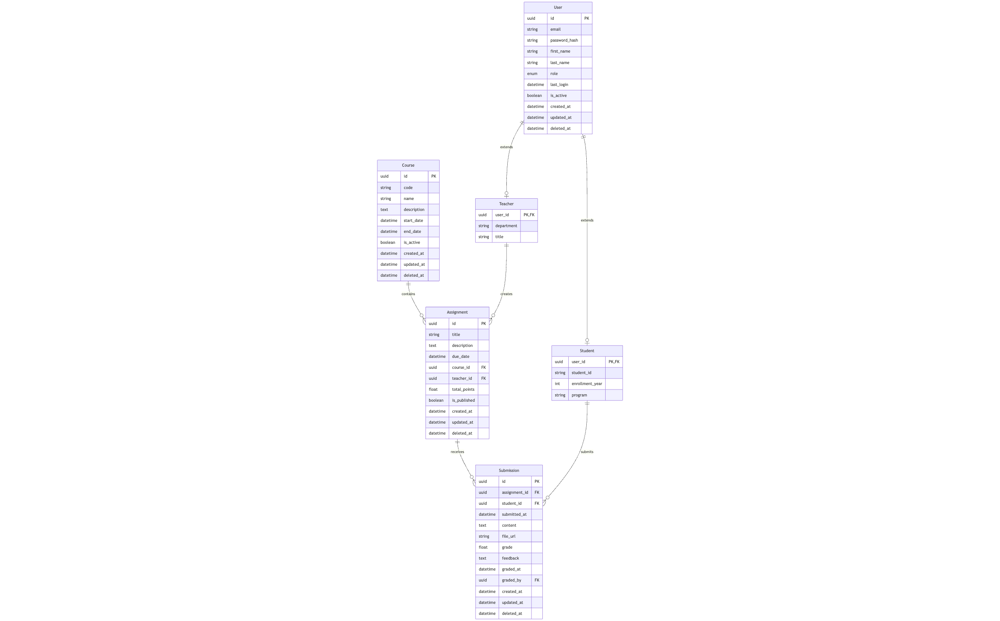

# Structure Design Decisions

## 1. Base Model with UUID

UUIDs prevent sequential ID guessing and work better in distributed systems
Consistent timestamp tracking helps with auditing and sorting
Soft deletes prevent data loss while maintaining referential integrity and data consistency

## 2. User Inheritance Pattern
The core User model captures common authentication data
Teacher and Student models extend User with role-specific attributes, and each created_by, updated_by, deleted_by fields all point to the User model using UUID
This approach provides clean separation of concerns while maintaining a single authentication flow

## 3. Many-to-Many Relationships

Teachers can teach multiple courses, and courses can have multiple teachers
Students can enroll in multiple courses, and courses have multiple students
Later on we could junction tables so we can make it traceable each student course and teacher course metadata.

## 4. Assignment Flow
Course creation is triggered by a teacher, and is linked to a course code
Assignments belong to courses and are created by teachers
Submissions link students to assignments, allowing for grades and feedback to be tracked and teacher can only giving grades to students who have submitted work

# Database Design Decisions

[](https://mermaid.live/edit#pako:eNrFVU2P2jAQ_SuRzyxiIQtLblWrXqpKlba9VEiRiQdi1bEje9wuBf57BwdISLzq9tA2ysGe9-yx33x4zwojgGUM7DvJt5ZXK53Q98WBTfbN-PR5L0VC_6cPrc2hlXqbQMWlGlhr7twPY0VeclcO0I20DnPNKxhAig8Q0L5KrFEdk-AIKCto6MpspW7BtSEu14l0OS9Qfo-tKyzQUOQcI6CvxcugAAVd8Lg6u_4MvCgjsnnSMg_ajd4P5RNQc4sVaBxAKPFy56uTJ_SCuH_oxDWriNBCknYBTbKqk_N8B9wOo2hNmxPXM7w13jp4ZXqc8mtgvI0vwjOSDq6wskZpdER0hyRSfppGQNCiB_2nDHjjnNzqKhafuDidCL9SCOGhd9ewfRFCckqAbvQDhE1a9rGNMhwTNMhVXhtKBheVr_ZrJV0J4t8o-OTXlSQVjf6dgsHGr4JHr96m_Q3WZtXJG_ZPGaJQGI2xmtxIBbm3qi8klYnoR3IDINa8-BbxHOi3bsOJz_b1Ln7gv6B46PSHw92dOVw7WJbQ8amq3JBy6T89yrklBNK-WwdZUJJL7W6bZJQZbucGtXTmdnIjSywUQHXtbrtijNkE2bER21opWIbWw4hVYOndoikLebZiWAL1JJbRUMCGe4UrttJHWlZz_dWY6rLSGr8tWbbhytGsEf38dl6tlpQBS6JoZNn8PuzBsj17ZtlsshzP0sXjPJ3OFw-zhxHbsSxNx9N0uVwsppM0vV9M0uOI_Qw-J-PHBXFASDT2Y_NWhyf7-AvlzWyU)

# Key Design Decisions

## 1. Separate User and Role Tables
Allows for clean separation of authentication and role-specific data
Better extensibility if new roles need to be added
More efficient queries when only basic user info is needed

## 2. Junction Tables with Metadata
The StudentCourse and TeacherCourse tables include additional fields beyond just IDs
This captures enrollment status, assigned roles, and timestamps
Allows for historical tracking of course participation

## 3. Submission as First-Class Entity
Submissions include complete metadata about the submission process
Tracking who graded the submission and when provides accountability
File URLs support document uploads separate from text content

## 4. Soft Delete Pattern
The DeletedAt field allows entities to be "removed" without losing data
Maintains referential integrity while allowing for data recovery